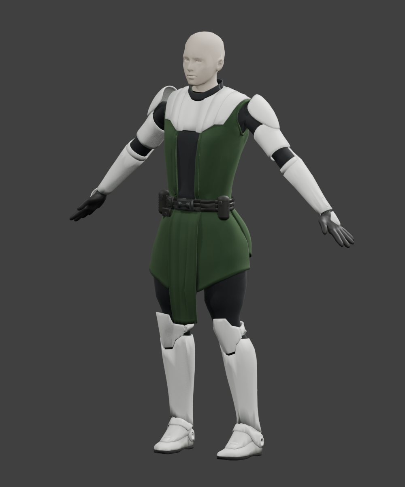

# Jedi Body C — Arma fit test V2

This test build repairs the character's clothing and glove deformation under Arma animation. It is ready for a local compatibility review. It does not replace the current published Aux armor addon.

## Use it

1. Clone or pull this repository with Git LFS enabled (`git lfs pull`). GitHub source ZIP downloads may contain LFS pointers instead of the real PBO.
2. In Arma 3 Launcher, add this folder as a local mod: `test-packages/character-fit-v2-2026-09-29/@CodexCharacterFit`.
3. Enable it and find **Jedi Body C - Arma Fit V2** in Eden. Unit: `CK_Fit_Jedi`. Uniform: `CK_U_Fit_Jedi`.
4. Load only one Codex Character Fit version; V1 and V2 share class names.
5. Check rifle aiming, walking/running, crouching, kneeling, prone and equipment changes with the weapons used by the unit.

## Repairs and verification

- Repaired shoulder/sleeve backing and finger binding; closed glove-tip openings. Rigid white armor and the fitted purchased hand-guard outlines remain rigid.
- Rebuilt paired heavy-cloth lower shells and improved front/rear leg following. A smooth trouser adjustment of at most 5 mm clears the final front-tabard breakthroughs without changing the tabard shape or character anatomy.
- Preserved the critical lower meshes in the nearest game LOD. The four visual levels contain 42,060 / 21,005 / 10,451 / 4,227 triangles.
- Verified a maximum of four influences and exact stored weight sums. Read the MLOD back to check vertices, faces, selections and UVs.
- Tested 140 sampled official animation poses, including every stored frame of the selected walk/run/crouchwalk cycles; reviewed 20 full-outfit renders and 18 focused distance-model views. The earlier 44-view upper review remains valid because the final 23 upper parts match exactly.
- The exact compiled PBO passed all 58 local dedicated-server assertions for loading, uniform exchange, animation states and support-skeleton motion. The raw test flags a startup `a3_characters_f` warning which also occurs in the vanilla-only control without this addon. The qualification is retained in the evidence; this is not a clean-log claim.

PBO SHA-256: `49e727b4c6fa38e31840a30a9739d175ab4dbaf132cb186fbd4162594b2d092c`.

## Current limits

The game materials are simple fit-test colors. The detailed Blender wool and armor wear still need texture baking. The head is temporary. Collision, shadow, memory and other support LODs retain provisional BI sample scaffolding. The farthest model has angular back shading that needs polish; checks confirmed fabric coverage there.

Some hidden waist/side overlaps, inner-shell contact and tight cloth folds remain. This is a skinned garment approximation. The dedicated server does not render the outfit, and these tests do not prove every animation, weapon-specific hand IK, mod combination or runtime LOD transition distance.

## Files

- `@CodexCharacterFit/`: loadable test addon, PBO stored through Git LFS.
- `source/ck_character_fit/`: editable MLOD, skeleton/config and test materials. The P3D is stored through Git LFS.
- `evidence/`: measured summaries and review qualifications. Paths in detailed reports refer to the local source study.
- `previews/`: Blender renders of the actual exported mesh using source preview materials; **not in-game screenshots or the packaged game material appearance**.

Original purchased archives, official animation files and scratch experiments are not included. Detailed working Blender scenes remain at `D:/CharacterKit/codex/studies/arma_fit_v2/`; the original v8 source is preserved unchanged.

